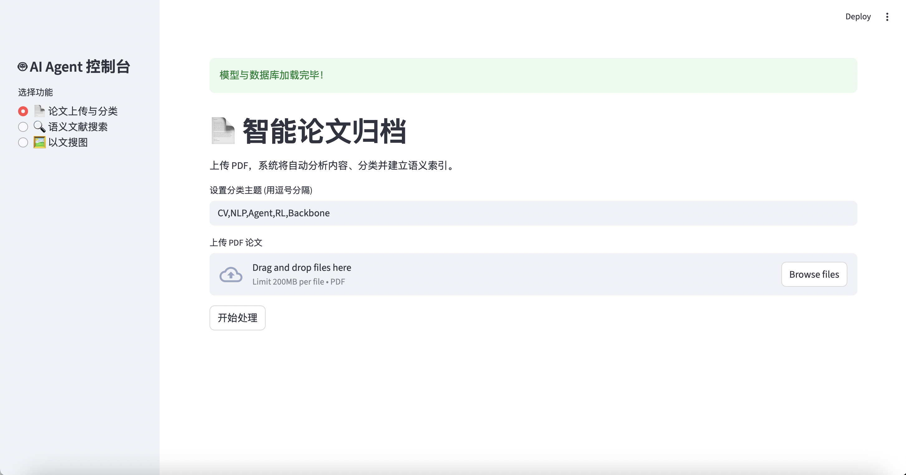
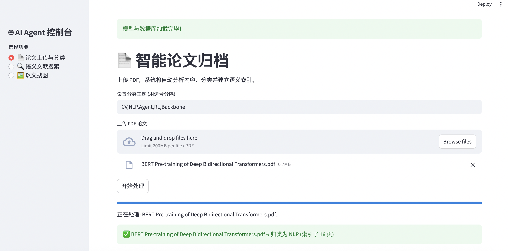
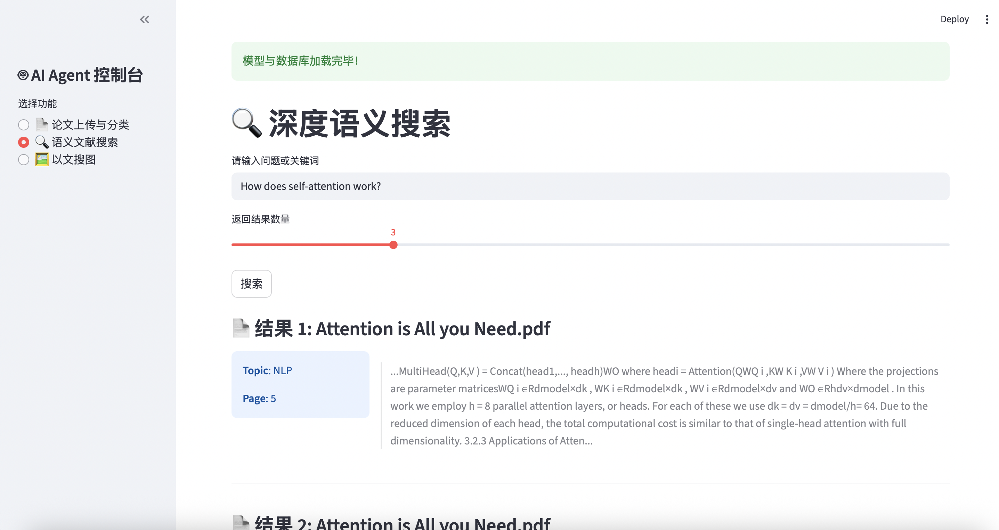
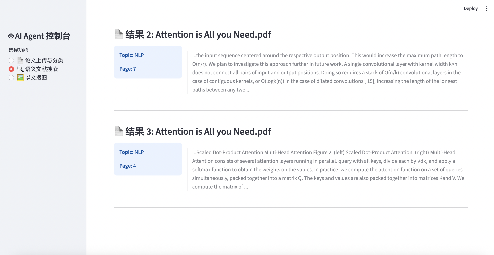
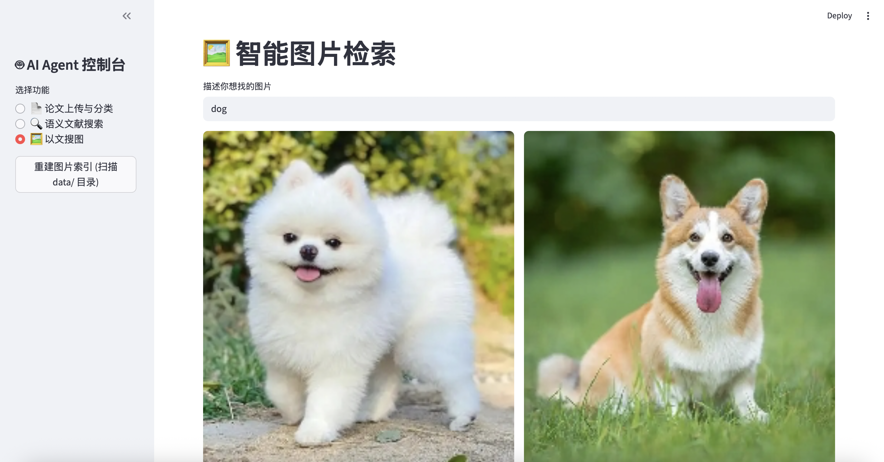

# **Local Multimodal AI Agent (本地多模态 AI 智能助手)**

## **1\. 项目简介 (Introduction)**

本项目是一个基于 Python 开发的本地多模态 AI 智能助手，旨在解决本地文献和图像素材管理的难题。不同于传统的文件名搜索，本项目利用 **RAG (检索增强生成)** 和 **多模态神经网络** 技术，实现了对本地 PDF 文献的**深度语义搜索**、**自动分类归档**以及**以文搜图**功能。

系统支持**完全本地化部署 (Offline)**，保护用户隐私。针对学术场景，项目实现了细粒度的**按页切分索引**，能够精确返回论文的具体片段与页码。此外，项目还提供了现代化的 **Web 可视化界面**，大幅提升交互体验。

## **2\. 核心功能 (Core Features)**

### **2.1 智能文献管理**

* **深度语义搜索**: 支持使用自然语言提问（如 "Self-attention mechanism"）。系统基于语义理解，能够检索出最相关的论文，并**精确返回具体页码 (Page Number) 和文本片段 (Snippet)**。  
* **自动分类与归档**:  
  * **单文件处理**: 上传新论文时，自动分析内容语义，将其归类并移动到对应的主题文件夹（如 CV/, NLP/, Agent/）。  
  * **批量整理**: 支持一键扫描混乱的 PDF 文件夹，自动识别主题并完成归档。

### **2.2 智能图像管理**

* **以文搜图**: 利用 CLIP 多模态图文匹配技术，支持通过自然语言描述（如 "A diagram of transformer architecture"）来查找本地图片库中最匹配的素材。

### **2.3 可视化交互界面 (Web UI)**

* **双引擎支持**: 本项目同时提供了 **Streamlit** (推荐) 和 **Gradio** 两种前端界面，支持拖拽上传、一键分类和图文结果的可视化展示。

## **3\. 技术架构 (Technical Architecture)**

本项目采用模块化设计，支持 GPU 加速，同时兼容无显卡的 CPU 环境。

### **3.1 模型配置**

* **文本嵌入**: SentenceTransformers (all-MiniLM-L6-v2)  
  * *特点*: 速度快，内存占用低，语义表征能力强。  
* **图像嵌入**: CLIP (ViT-B-32)  
  * *特点*: OpenAI 开源的经典图文匹配模型，支持零样本 (Zero-shot) 分类。  
* **向量数据库**: ChromaDB  
  * *特点*: 嵌入式轻量级数据库，无需服务器部署，开箱即用。

### **3.2 进阶扩展接口 (Future Roadmap)**

架构预留了高性能扩展接口（对应作业进阶要求）：

* **视觉增强**: 支持接入 **Florence-2** 实现图像 OCR 与详细描述生成。  
* **文本增强**: 支持接入本地 LLM (如 **Llama-3** via Ollama) 进行深度摘要与推理。

## **4\. 环境与安装 (Installation)**

### **4.1 基础环境**

* **OS**: Linux (推荐) / Windows / macOS  
* **Python**: 3.8+ (推荐 Python 3.10)  
* **硬件**: 至少 8GB 内存。支持 CUDA 加速（推荐），也可纯 CPU 运行。

### **4.2 安装依赖**

推荐使用 Conda 管理环境以避免编译问题（特别是 PyArrow）。

\# 1\. 创建环境  
conda create \-n ai\_agent python=3.10 \-y  
conda activate ai\_agent

\# 2\. 安装 PyArrow (Streamlit 依赖，推荐 conda 安装以避免 gcc/cmake 报错)  
conda install pyarrow \-y

\# 3\. 安装项目依赖  
pip install \-r requirements.txt

*(注：如果在安装 PyTorch 时遇到问题，请确保版本与 CUDA 驱动匹配。)*

### **4.3 模型准备 (Offline Setup)**

为确保完全离线运行，本项目不包含大模型文件。请手动下载 sentence-transformers/all-MiniLM-L6-v2 和 clip-ViT-B-32 的权重文件，并按以下结构放入 models/ 目录。

**目录结构需严格如下：**

project\_root/  
├── main.py  
├── app.py                   \<-- \[Streamlit Web 界面\]  
├── gradio\_app.py            \<-- \[Gradio Web 界面\]  
├── utils.py  
├── model\_loader.py  
├── requirements.txt  
├── models/                  \<-- \[用户需手动创建并放入模型\]  
│   ├── all-MiniLM-L6-v2/    (包含 config.json, pytorch\_model.bin 等)  
│   └── clip-ViT-B-32/       (包含 config.json, model.safetensors 等)  
├── data/                    (用户存放数据的目录)  
└── db/                      (自动生成的数据库文件)

## **5\. 使用说明 (Usage Guide)**

本项目提供 **Web 界面 (GUI)** 和 **命令行 (CLI)** 两种使用方式。

### **方式一：Web 可视化界面 (推荐)**

启动 Streamlit 界面，获得最佳体验：

streamlit run app.py

启动后请在浏览器访问显示的 URL (如 http://localhost:8501)。  
(注：如果服务器只有 SSH 权限，请使用 SSH 隧道转发端口：ssh \-L 8501:localhost:8501 user@server\_ip)  
*备选方案：使用 Gradio 启动 python gradio\_app.py。*

### **方式二：命令行工具 (CLI)**

适合在无图形界面的服务器上快速评测。

#### **1\. 添加与分类论文**

python main.py add\_paper "data/Attention is All you Need.pdf" \--topics "CV,NLP,RL"

*执行后，文件将自动移动到 data/NLP/ 目录下。*

#### **2\. 批量整理文件夹**

\# 扫描 data 目录下所有 PDF 并自动归档  
find data \-maxdepth 1 \-name "\*.pdf" \-print0 | while IFS= read \-r \-d '' file; do  
    python main.py add\_paper "$file" \--topics "CV,NLP,Agent"  
done

#### **3\. 语义搜索 (含页码定位)**

python main.py search\_paper "How does self-attention mechanism work?"

#### **4\. 图像搜索**

\# 先建立索引  
python main.py index\_images "data/"  
\# 再搜索  
python main.py search\_image "A screenshot of computer code"

## **6\. 运行效果截图 (Screenshots)**

### **6.1 Web 界面操作**

### **6.2 命令行分类与索引**

### **6.3 语义搜索结果 (精准定位)**

### **6.4 图像搜索结果**

## **7\. 常见问题 (FAQ)**

Q1: 为什么以文搜图结果里出现了不相关的图片（如搜狗出现了猫）？  
A: 这是 CLIP 模型的 Top-K 召回机制与语义距离共同作用的结果。  
系统被强制要求返回 Top-3 结果。当库中只有一张“狗”的图片时，模型会自动寻找语义距离最近的图片补位。在向量空间中，“猫”与“狗”的距离远比“花朵”或“风景”更近，因此选择猫作为补充结果是符合语义逻辑的正确行为。  
Q2: 为什么 Web 界面无法安装或启动？  
A: Streamlit 依赖 pyarrow，在某些老旧 Linux 系统上可能因 cmake 版本过低导致编译失败，或者因为 numpy 2.x 版本不兼容导致 ImportError。  
解决方案:

1. 使用 conda install pyarrow 安装二进制包。  
2. 确保 numpy 版本兼容：pip install "numpy\<2.0.0"。  
3. 如果仍无法解决，请使用 CLI 命令行模式进行作业评测，核心 RAG 功能逻辑完全一致。

*Created for Multimodal Machine Learning Course Assignment.*